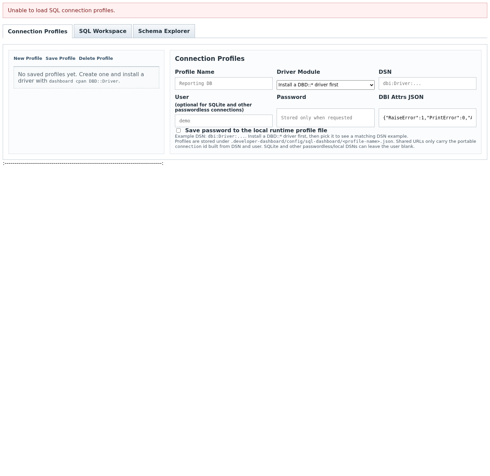
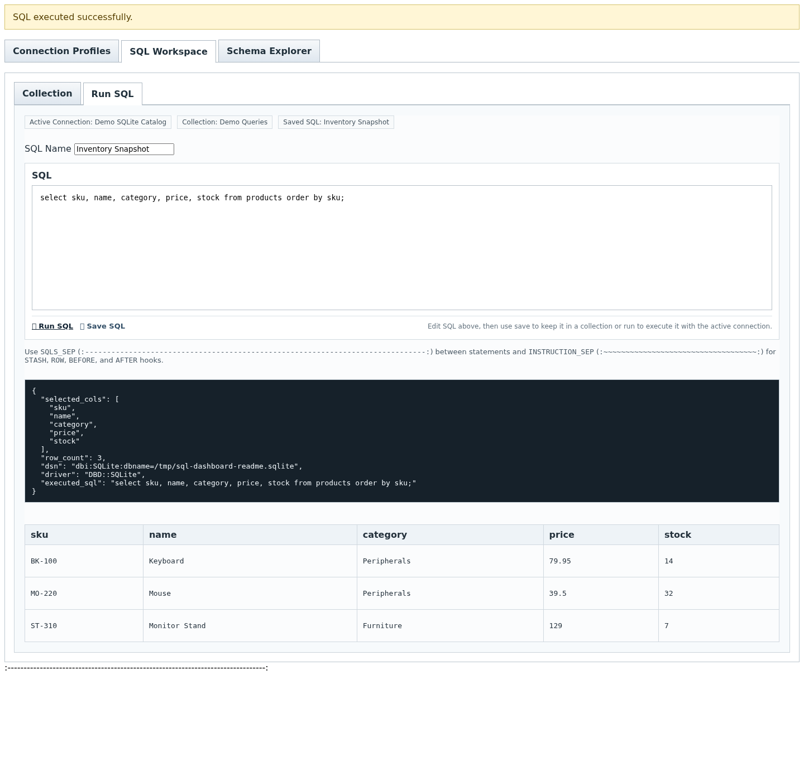
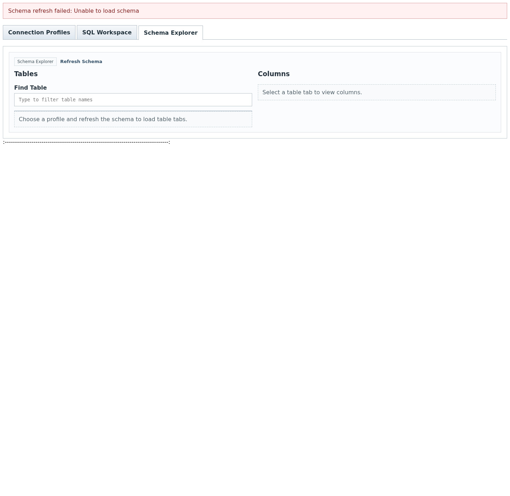

# sql-dashboard

## Description

`sql-dashboard` is a Developer Dashboard skill that gives users a browser-based SQL workspace inside DD.

## Value

It gives developers, operators, and analysts one place to manage connection profiles, write and rerun SQL, browse schema details, and inspect results without leaving Developer Dashboard.

## Problem It Solves

SQL work often gets split across terminal sessions, ad hoc client tools, copied DSNs, and temporary notes. That makes it harder to keep connection details, query collections, schema browsing, and result handling together in one repeatable workspace.

## What It Does To Solve It

This skill adds a SQL workspace to DD. It lets the user:

- create and save connection profiles
- choose from installed `DBD::*` drivers
- write and run SQL in the browser
- save useful SQL snippets into collections
- browse schema and column metadata
- inspect query results and shape rendered output through the workspace hooks

This repo proves the shipped skill page still loads and exposes the documented workspace controls. It does not re-run the full multi-database vendor matrix inside this ticket.

## Developer Dashboard Feature Added

This skill adds a browser page at:

- `http://127.0.0.1:7890/app/sql-dashboard`

## What Is Included

- a SQL workspace page at `dashboards/index`
- the matching ajax request handlers under `dashboards/ajax/`
- DD skill-prefixed ajax routing through `/ajax/sql-dashboard/...`
- a database support report under `docs/database-support.md`
- Docker-only regression tests for copy integrity and browser layout smoke coverage

## Installation

Install the skill from its repo:

```bash
dashboard skills install git@github.mf:manif3station/sql-dashboard.git
```

For local development in this workspace:

```bash
dashboard skills install ~/projects/skills/skills/sql-dashboard
```

## License

`sql-dashboard` is released under the MIT License.

See [LICENSE](LICENSE).

## How To Use It

Open the page in DD after install:

```bash
dashboard restart
```

Then visit:

```text
http://127.0.0.1:7890/app/sql-dashboard
```

The page provides:

- Connection Profiles
- SQL Workspace
- Schema Explorer
- saved SQL collections
- driver-aware DSN guidance

## Screenshots

Connection Profiles below is captured from a Docker-generated SQLite demo profile, so the README shows a working local-file setup rather than an empty shell state.



SQL Workspace below shows a saved SQLite query running against a dummy catalog database and returning rows in the result pane.



Schema Explorer below shows the dummy SQLite schema so the user can see how table and column browsing looks in a populated workspace.



## Runtime Dependency Notes

This skill is a browser workspace. Query execution depends on `DBI` and whichever `DBD::*` driver matches the target database.

Examples:

```bash
dashboard cpan DBD::SQLite
dashboard cpan DBD::mysql
dashboard cpan DBD::Pg
dashboard cpan DBD::ODBC
dashboard cpan DBD::Oracle
```

## Normal Cases

```text
/app/sql-dashboard opens a SQL workspace with Connection Profiles, SQL Workspace, and Schema Explorer sections
```

```text
The page lets the user keep saved connection profiles, edit SQL, and browse schema details in one place
```

```text
The page runs SQL and returns result data through the workspace result area and saved SQL flow
```

```text
The browser workspace resolves its DD-backed request handlers through /ajax/sql-dashboard/... so the page and saved workers stay namespaced to this skill
```

```text
DD uses the same skill-prefixed route family for app and static assets, so browser-facing skill assets follow /app/<skill>/..., /ajax/<skill>/..., and when present /js/<skill>/..., /css/<skill>/..., and /others/<skill>/...
```

## Edge Cases

```text
If no `DBD::*` drivers are installed, the page still renders but query execution and driver-specific work will not be usable until the user installs a driver.
```

```text
If a vendor driver needs native client libraries in addition to the Perl module, those host-side pieces must also be installed before that database family will work.
```

```text
If DD is not running, the browser route will not load until `dashboard restart` brings the web app back.
```

## Docs

- `docs/overview.md`
- `docs/usage.md`
- `docs/database-support.md`
- `docs/changes/2026-04-29-extraction.md`
- `docs/changes/2026-04-29-documentation-refresh.md`
- `docs/changes/2026-04-29-readme-screenshots.md`
- `docs/changes/2026-04-29-sqlite-demo-screenshots.md`
- `docs/changes/2026-04-29-ajax-workers-restored.md`
- `docs/changes/2026-04-30-skill-prefixed-ajax-routes.md`
- `docs/images/sql-dashboard-profiles.png`
- `docs/images/sql-dashboard-workspace.png`
- `docs/images/sql-dashboard-schema.png`
